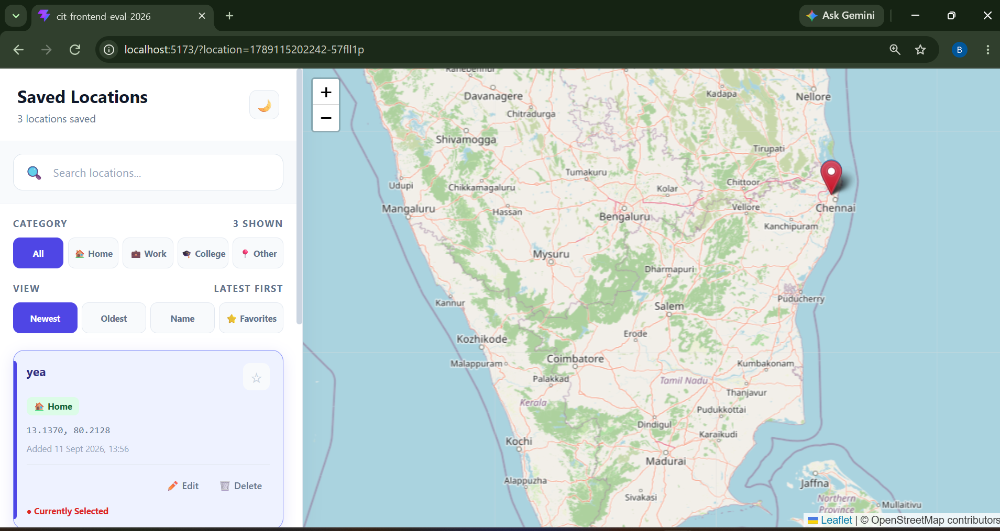
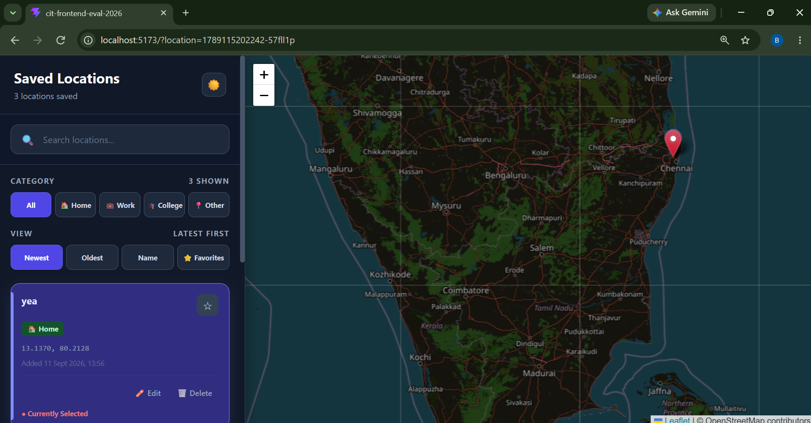
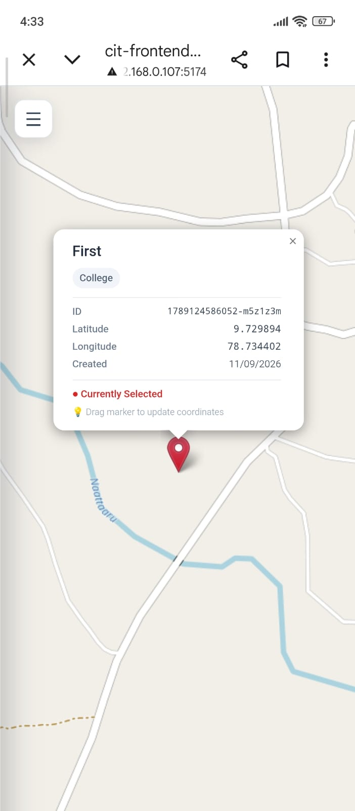

#(MapMarks) Location Manager

An interactive map application for saving, organizing, and managing favorite
locations. Built with React, Vite, and React-Leaflet (OpenStreetMap tiles).

**Live Demo:** [https://cit-frontend-eval-2026.vercel.app/](https://cit-frontend-eval-2026.vercel.app/)

## Setup & Run Instructions

**Requirements:** Node.js 18+ and npm.

```bash
# Install dependencies
npm install

# Start the dev server (http://localhost:5173)
npm run dev

# Build for production
npm run build

# Preview the production build locally
npm run preview

# Lint the codebase
npm run lint
```

## Environment Variables

**None required.** The app uses free, unauthenticated public services:

- **Map tiles:** OpenStreetMap (`tile.openstreetmap.org`) — no API key.
- **Reverse geocoding:** OpenStreetMap Nominatim (`nominatim.openstreetmap.org`) — no API key.

No `.env` file is needed to run the project.

## Core Features

- Interactive map with pan and zoom support.
- Add favorite locations by clicking on the map.
- Saved locations displayed as map markers and sidebar items.
- Select a location from the map or sidebar and focus the map on it.
- Edit saved location names with validation.
- Delete saved locations with selection-state handling.
- Search saved locations dynamically by name.
- Handle empty saved-location and no-search-results states.
- Persist saved locations using `localStorage`.
- Responsive design for desktop and smaller screens.
- Loading and error handling for location lookup.

## Architecture Overview

### State management

All location data lives in a single `locations` array in `App.jsx`,
which is the **single source of truth**. `Sidebar` and `InteractiveMap`
are both purely presentational — they receive `locations` and
`selectedLocation` as props and call handler callbacks (`onSelectLocation`,
`onEditLocation`, `onDeleteLocation`, etc.) rather than owning their own
copy of the data.

Selection state, the currently open modal, search query, and theme are
kept as separate `useState` values in `App.jsx` rather than one large
object, since they change independently and for different reasons.

### Component structure

```
App.jsx                  – state, handlers, persistence, orchestration
  ├─ Sidebar.jsx          – search, filter, sort, location list, theme toggle
  ├─ InteractiveMap.jsx   – Leaflet map, markers, popups, map click/drag events
  └─ AddLocationModal.jsx – add/edit form with validation
  └─ LocationPopup.jsx -Displays location details inside the map marker popup
``` 

### Data flow

1. User clicks the map → `InteractiveMap` fires `onMapClick` with lat/lng.
2. `App.jsx` reverse-geocodes the coordinates (Nominatim) to suggest a name,
   then opens `AddLocationModal` pre-filled with that name.
3. On save, `App.jsx` updates the single `locations` array.
4. Since both `Sidebar` and `InteractiveMap` render from that same array,
   the new marker and the new sidebar entry appear simultaneously.
5. Selecting a location (from either the map or the sidebar) updates
   `selectedLocation`, which both components use to highlight the
   matching marker/list item and fly the map to it.

### Persistence

Locations and the theme preference are persisted to `localStorage` via
`useEffect` hooks that write on every change, and are restored lazily
in `useState` initializers on load (wrapped in `try/catch` in case
storage is unavailable or corrupted).

## Implemented Enhancements

Beyond the core requirements, the following optional enhancements are implemented:

- **Reverse geocoding** — clicking the map auto-suggests a place name via Nominatim, with a loading indicator and a coordinate-based fallback if the lookup fails.
- **Categories** (Home / Work / College / Other) with sidebar filtering.
- **Sorting** saved locations (e.g. newest first).
- **Marker popups** showing name, category, notes, ID, coordinates, and created date.
- **Draggable markers** — dragging a marker updates its stored coordinates.
- **Undo delete** — a 5-second toast lets you restore a just-deleted location.
- **Favorites** — locations can be starred/favorited.
- **Dark/light theme** — toggles both the sidebar UI and the Leaflet map tiles.
- **Keyboard accessibility** — `Alt + 1–9` selects the corresponding location by index without touching the mouse. Covers the first 9 locations; beyond that, selection is via the sidebar.
- **URL-based selection** — selecting a location updates the URL's `?location=` query param, and reloading/opening that URL restores the selection and map focus.


## Screenshots

| Light Mode | Dark Mode |
|---|---|
|  |  |

**Mobile View**


